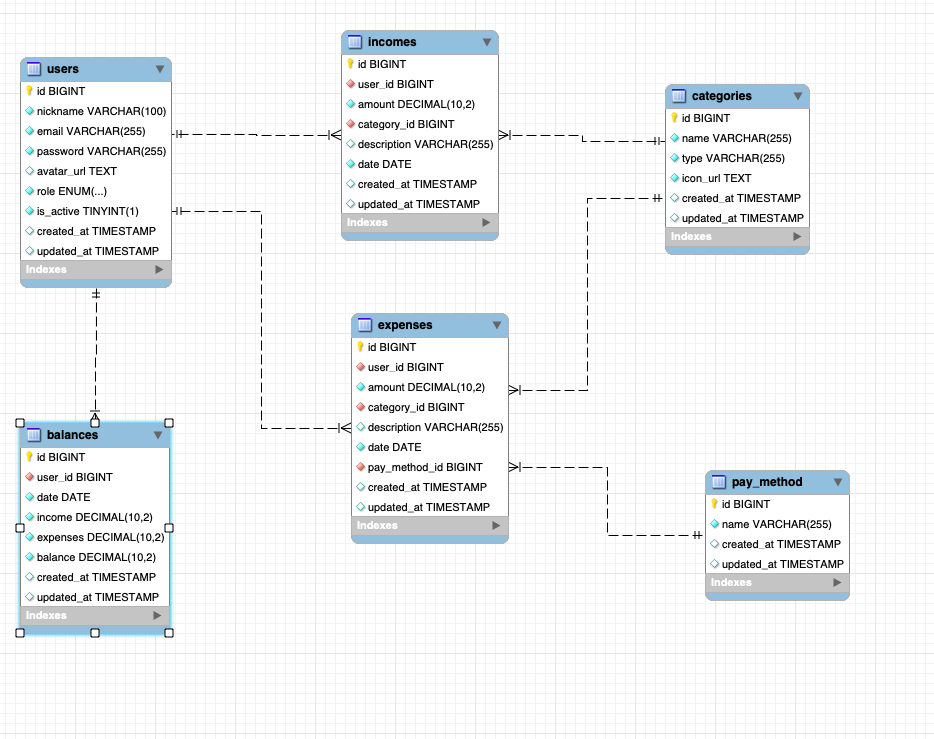

<div align=center>

# Xpenses Api 📊

 Este es la api de un sistema de registro y control de gastos personales. Este proyecto se realizó como trabajo final del Bootcamp Full Stack Developer de [](https://geekshubsacademy.com/)


## Tecnologias Utilizadas
[](https://www.php.net/manual/es/intro-whatis.php)[](https://www.mysql.com/)[](https://laravel.com/)[](https://stackoverflow.com/)[](https://code.visualstudio.com/)[](https://git-scm.com/)[](https://github.com/)[](https://www.thunderclient.com/)
</div>

## Tabla de Contenidos
- 🧾[Diseño BBDD](#diseño-bbdd)
- ⚙️[Instalacion en local](#einstalacion-en-local)
- 🎯[Endpoints](#endpoints)
- 🛠️[Posibles Mejoras](#posibles-mejoras)
- 💻[Contacto](#contacto)
- 🪪[Creditos](#creditos)

## Diseño BBDD


## Instalacion en local

1. Clonar el repositorio con el comando`$ git clone [URL del repositorio]`
2. Instalar dependencias con el comando` $ composer install `
3. Conectamos nuestro repositorio con nuestra base de datos, en el archivo ".env.example" tenemos un ejemplo, copiamos el archivo y quitamos el ".example" y el archivo deberia quedar ".env", sustituimos valores con las credenciales de nuestra base de datos. 
 ```
DB_CONNECTION=mysql
DB_HOST="database host"
DB_PORT="database port"
DB_DATABASE="database name"
DB_USERNAME="username"
DB_PASSWORD="database password"
```

4. Ejecutamos las migraciones con el comando`$ php artisan migrate`
5. Ejecutamos el comando`$ php artisan db:seed` para los seeders
6. Levantamos el servidor con `$ php artisan serve`

## Endpoints
<details>
<summary> Endpoints </summary>

- REGISTER
        POST http://localhost:8000/api/register
        body:
            {
                "name":"vanessa",
                "email":"vanessa@gmail.com",
                "password": "123456",
            }

- LOGIN
        POST http://localhost:8000/api/login
        body:
            {
                "email":"vanessa@gmail.com",
                "password": "123456",
            }

-  GET PROFILE
        GET http://localhost:8000/api/profile
        
- ADD EXPENSE
        POST http://localhost:8000/api/new-expense
        body:
            {
                "amount":110,
                "category_id":2,
                "description":"renta",
                "date":"2023-12-03",
                "pay_method_id":1
            }

- ADD INCOME
        POST http://localhost:8000/api/new-income
        body:
            {
                "amount":1100,
                "category_id":10,
                "description":"salary",
                "date":"2023-12-03"
            }

- EDIT NICKNAME
        PUT http://localhost:8000/api/edit-nickname
        body:
            {
                "nickname":"vane99",
            }

- CHANGE AVATAR
        PUT http://localhost:8000/api/edit-avatar
        body:
            {
                "avatar_url":"https://img.icons8.com/external-outline-icons-mangsaabguru-/100/1A1A1A/external-african-avatar-outline-outline-icons-mangsaabguru--2.png"
            }

- GET ALL EXPENSES BY DATE
        GET http://localhost:8000/api/expenses?month={}&year={}
        
- GET ALL INCOMES BY DATE
        GET http://localhost:8000/api/incomes?month={}&year={}

- GET BALANCE BY DATE (MONTHLY)
        GET http://localhost:8000/api/balance-date?month={}&year={}
        
- DELETE EXPENSE
        DELETE http://localhost:8000/api/delete-expense/1

- DELETE INCOME
        DELETE http://localhost:8000/api/delete-income/1
        
#### Super admin endpoints

- GET ALL USERS
        GET http://localhost:8000/api/all-users

- GET ALL CATEGORIES
        GET http://localhost:8000/api/all-categories

- ACTIVATE USER
        PUT http://localhost:8000/api/user-activate/{id}

- INACTIVATE USER
        PUT http://localhost:8000/api/user-inactivate/{id}

- CHANGE USER ROLE 
        PUT http://localhost:8000/api/user-role/{id}
        body:
            {
                "role":"admin",
            }


</details>

## Contacto

[](mailto:vanessabritogonzalez@gmail.com)
[](https://www.linkedin.com/in/vanessabritogonzalez/)

## Creditos
Este proyecto ha sido realizado por mi, Vanessa Brito, como trabajo final del Bootcamp Full Stack Developer de [](https://geekshubsacademy.com/)